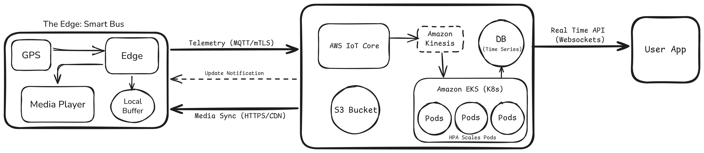

Project UrbanPulse is a resilient, cloud-native infrastructure designed to power a fleet of 500 smart buses. This system bridges the gap between moving vehicles and cloud services, ensuring real-time telemetry and seamless media delivery even in challenging network environments.

## Architecture Overview

- **The Edge (Bus):** Every bus sends GPS and speed updates every 2 seconds while handling its own media playback.

- **The Cloud (AWS Infrastructure):** This is the brain of the operation, using managed services for ingestion and storage.

- **The User-App:** Where passengers see live bus locations with minimal lag.

## 🛠️ Technical Justification

**1. Handling Dead Zones (Connectivity & Resilience)**

- **MQTT & mTLS:** I went with MQTT because it’s lightweight and holds a connection better than standard HTTP. For security, I used mTLS so that only buses with the right hardware certificates can talk to our servers.

- **Local Buffering:** If a bus hits a dead zone, the Edge Gateway saves the data to a local buffer. As soon as it finds a signal again, it flushes that data to the cloud so we don't lose the history.

**2. Low Latency (<3s Lag)**

- **Amazon Kinesis:** Acts as a high-throughput buffer to ingest telemetry spikes without overwhelming downstream services.

- **Amazon Timestream:** I chose this over a standard database because it’s optimized for time-stamped location data, making queries incredibly fast. (If we wanted to use an open-source alternative, InfluxDB would be another great choice here)

- **WebSockets:** Instead of the app constantly asking "where is the bus?", we push the update to the app via WebSockets the moment it arrives in our system.

**3. Efficiency & Scalability**

- **Kubernetes (EKS):** All cloud-side services are containerized using Docker and orchestrated via Amazon EKS.

- **Horizontal Pod Autoscaler:** During the 7 AM – 9 AM rush, the Horizontal Pod Autoscaler (HPA) automatically spins up more workers to handle the extra traffic. At night, it scales back down to save on AWS costs.

**4. Media Delivery**

- **Push-Pull Model:** When new ads are ready, AWS IoT Core sends a tiny "ping" to the bus. The bus then downloads the video from Amazon S3 via a CDN. By saving the video locally, it never buffers for the passenger, even if the bus goes offline mid-play.

## 🚀 CI/CD Pipeline
The deployment lifecycle is fully automated to ensure stability and rapid iteration:

- **GitHub Actions:** Automatically builds and tests the Docker images on every push.

- **Amazon ECR:** Stores our verified, ready-to-deploy images.

- **Rolling Updates:** Kubernetes updates the "Pods" one by one. This means we can deploy new features in the middle of the day without the tracking system ever going down.

## 🧰 Tech Stack Summary
- **Edge:** Docker, MQTT, SQLite (Local Buffer).

- **Cloud:** AWS IoT Core, Amazon Kinesis, Amazon EKS (Kubernetes), Amazon Timestream, S3.

- **Security:** mTLS, X.509 Certificates.

- **Monitoring:** Prometheus & Grafana.
